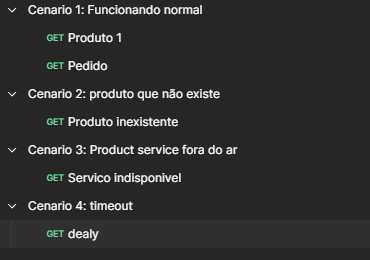
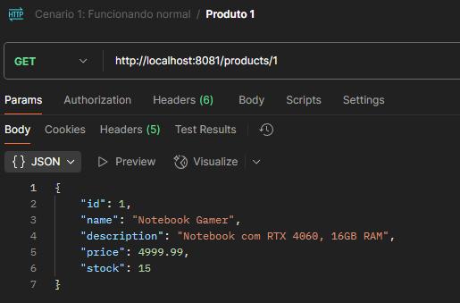
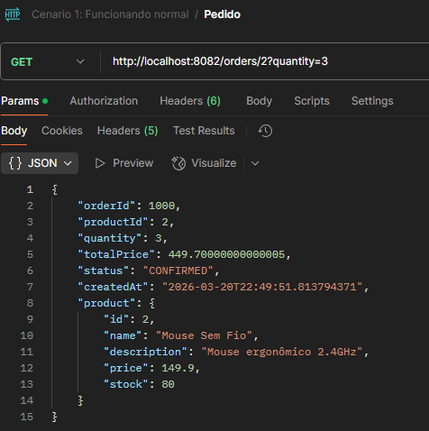
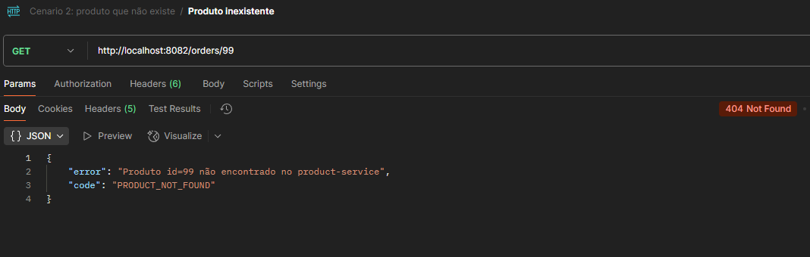
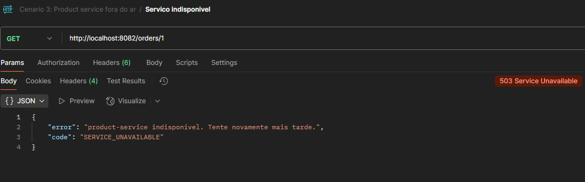
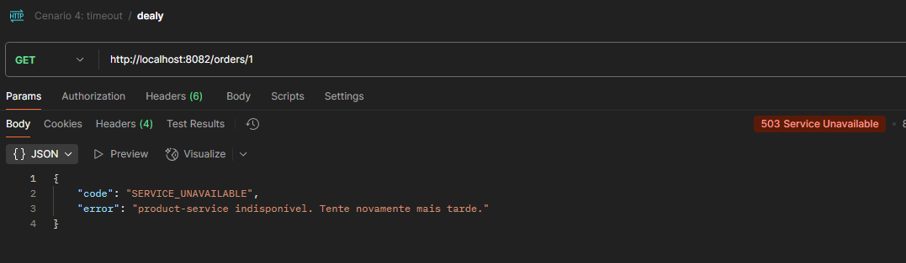

# E-commerce Microsserviços — Comunicação Síncrona com Spring Boot

Atividade prática sobre comunicação síncrona entre microsserviços utilizando **Java Spring Boot** e **Docker Compose**.

---

## Arquitetura

```
┌─────────────────────┐        HTTP REST         ┌──────────────────────┐
│                     │  GET /products/{id}       │                      │
│   order-service     │ ─────────────────────────▶│   product-service    │
│   (porta 8082)      │ ◀─────────────────────────│   (porta 8081)       │
│                     │      ProductInfo JSON      │                      │
└─────────────────────┘                           └──────────────────────┘
```

- **product-service** (porta `8081`): retorna dados simulados de produtos em memória.
- **order-service** (porta `8082`): recebe uma requisição de pedido, consulta o `product-service` via HTTP e monta a resposta com os dados do produto.

---

## Estrutura do projeto

```
ecommerce-microsservicos/
├── docker-compose.yml
├── product-service/
│   ├── pom.xml
│   └── src/main/java/br/edu/ifsp/productservice/
│       ├── ProductServiceApplication.java
│       ├── controller/ProductController.java
│       ├── model/Product.java
│       └── service/ProductService.java
└── order-service/
    ├── pom.xml
    └── src/main/java/br/edu/ifsp/orderservice/
        ├── OrderServiceApplication.java
        ├── config/RestTemplateConfig.java
        ├── controller/OrderController.java
        ├── model/Order.java
        ├── model/ProductInfo.java
        └── service/OrderService.java
```

---

## Endpoints

### product-service

| Método | Endpoint         | Descrição                   |
|--------|------------------|-----------------------------|
| GET    | `/products/{id}` | Retorna dados de um produto |

**Produtos disponíveis (IDs 1–5):**

| ID | Nome             | Preço      |
|----|------------------|------------|
| 1  | Notebook Gamer   | R$ 4999,99 |
| 2  | Mouse Sem Fio    | R$ 149,90  |
| 3  | Teclado Mecânico | R$ 349,00  |
| 4  | Monitor 27"      | R$ 1799,00 |
| 5  | Headset Gamer    | R$ 299,90  |

### order-service

| Método | Endpoint                         | Descrição                              |
|--------|----------------------------------|----------------------------------------|
| GET    | `/orders/{productId}?quantity=N` | Cria pedido consumindo product-service |

---

## Como executar

### Pré-requisitos

- [Docker Desktop](https://www.docker.com/products/docker-desktop/) instalado e rodando

### Subir os serviços

```bash
docker compose up --build
```

O `order-service` só sobe após o `product-service` passar no healthcheck. O terminal mostra os dois containers inicializando:


---

## Simulações

As simulações foram feitas utilizando o Postman, com as seguintes coleções organizadas:



---

### Cenário 1: Funcionamento normal

Chamada direta ao `product-service` para buscar o produto de ID 1:
```
GET http://localhost:8081/products/1
```



Criação de pedido via `order-service`, que internamente consulta o `product-service`:
```
GET http://localhost:8082/orders/2?quantity=3
```



O `order-service` buscou os dados do produto no `product-service`, calculou o preço total (`149.90 × 3 = 449.70`) e retornou o pedido completo com status `CONFIRMED`.

---

### Cenário 2: Produto não encontrado

```
GET http://localhost:8082/orders/99
```



O `product-service` retornou `404` para o produto de ID 99 (inexistente). O `order-service` capturou o erro via `HttpClientErrorException.NotFound` e repassou uma resposta amigável ao cliente com o código `PRODUCT_NOT_FOUND`.

---

### Cenário 3: Falha na comunicação com o product-service

Para simular a falha, o `product-service` foi derrubado:

```bash
docker compose stop product-service
```

Em seguida, tentamos criar um pedido:
```
GET http://localhost:8082/orders/1
```



O `order-service` tentou chamar o `product-service`, não conseguiu estabelecer conexão e retornou `503 Service Unavailable`. O erro foi capturado via `ResourceAccessException` e tratado adequadamente.

Isso demonstra o problema de **acoplamento temporal**: quando um serviço cai, todos os serviços que dependem dele sincronamente também falham.

---

### Cenário 4: Timeout por lentidão no product-service

No `docker-compose.yml`, configuramos um delay de 5 segundos no `product-service` e um timeout de 2 segundos no `order-service`:

```yaml
# product-service
- PRODUCT_RESPONSE_DELAY_MS=5000

```

```bash
docker compose down
docker compose up --build
```

```
GET http://localhost:8082/orders/1
```



O `product-service` demorou 5 segundos para responder, mas o `order-service` tem timeout configurado em 0. Após 8 segundos, a conexão foi encerrada e o erro foi tratado retornando `503 Service Unavailable`.


---

## Resposta: Quais problemas podem ocorrer neste tipo de implementação?

### 1. Acoplamento temporal
Os dois serviços precisam estar disponíveis ao mesmo tempo. Se o `product-service` cair, o `order-service` falha junto, mesmo que a lógica de pedidos não precise de uma resposta imediata. Demonstrado no **Cenário 3**.

### 2. Latência em cascata
Em sistemas com muitos microsserviços encadeados (A chama B, que chama C...), o tempo de resposta total é a soma das latências de cada hop. Um serviço lento contamina toda a cadeia. Demonstrado no **Cenário 4**.

### 3. Falhas em cascata (Cascade Failure)
Se o `product-service` ficar lento, as threads do `order-service` ficam presas aguardando resposta. Com volume alto, o pool de threads esgota e o `order-service` também para de responder, mesmo para requisições que não envolvem produtos.


### 4. Retry sem idempotência
Tentativas automáticas de retry em operações não-idempotentes (como criação de pedidos) podem gerar pedidos duplicados.

### 5. Ausência de observabilidade distribuída
Sem tracing distribuído, é difícil rastrear onde exatamente a latência ou falha ocorreu numa cadeia de chamadas síncronas.